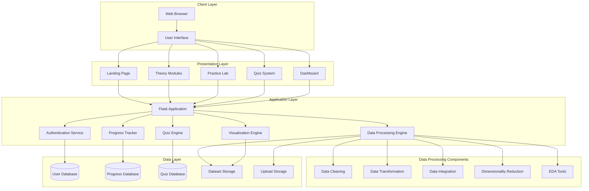
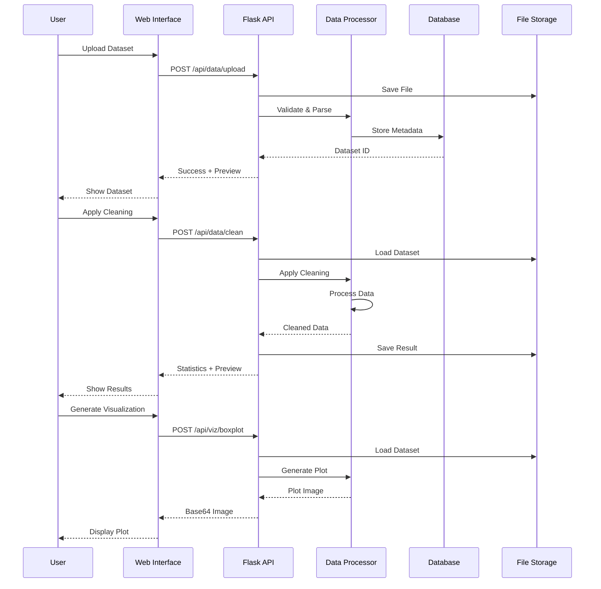
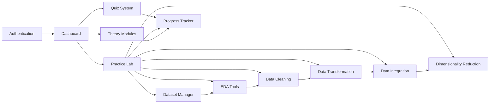

<<<<<<< HEAD
# Implementation Roadmap - Data Preprocessing Educational Platform

## Project Timeline: 8 Weeks

### Week 1: Foundation & Setup

#### Days 1-2: Project Initialization
- [x] Define architecture and technology stack
- [ ] Initialize Git repository
- [ ] Create project directory structure
- [ ] Set up virtual environment
- [ ] Install core dependencies
- [ ] Configure Flask application
- [ ] Set up development database (SQLite)

**Deliverables:**
- Working Flask application skeleton
- Database connection established
- Basic routing structure

#### Days 3-5: Database & Authentication
- [ ] Design database schema
- [ ] Create SQLAlchemy models
- [ ] Implement user registration
- [ ] Implement user login/logout
- [ ] Add password hashing
- [ ] Create user dashboard template
- [ ] Test authentication flow

**Deliverables:**
- User authentication system
- Basic user dashboard
- Database migrations setup

#### Days 6-7: Base UI Structure
- [ ] Create base HTML template
- [ ] Set up Bootstrap 5
- [ ] Design navigation menu
- [ ] Create landing page
- [ ] Design responsive layout
- [ ] Add CSS styling
- [ ] Create footer with links

**Deliverables:**
- Responsive base template
- Navigation system
- Landing page

---

### Week 2: Core Data Infrastructure

#### Days 8-10: Dataset Management
- [ ] Create dataset upload functionality
- [ ] Implement file validation
- [ ] Add dataset preview feature
- [ ] Create dataset storage system
- [ ] Download sample datasets (Titanic, Housing, Iris, etc.)
- [ ] Organize pre-loaded datasets
- [ ] Create dataset selection interface

**Deliverables:**
- File upload system
- Dataset preview functionality
- 6 pre-loaded datasets ready

#### Days 11-14: Basic EDA Tools
- [ ] Implement statistical summary generation
- [ ] Create data type detection
- [ ] Add missing value analysis
- [ ] Implement basic visualizations:
  - Box plots
  - Histograms
  - Scatter plots
- [ ] Create visualization API endpoints
- [ ] Design EDA interface
- [ ] Add interactive controls

**Deliverables:**
- Working EDA module
- Basic visualization tools
- Statistical summary display

---

### Week 3: Data Cleaning Module

#### Days 15-17: Missing Value Handling
- [ ] Implement mean/median/mode imputation
- [ ] Add forward/backward fill
- [ ] Implement KNN imputation
- [ ] Create missing value visualization
- [ ] Design cleaning interface
- [ ] Add parameter controls
- [ ] Implement preview functionality

**Deliverables:**
- Complete missing value handling
- Interactive cleaning interface

#### Days 18-21: Duplicates & Outliers
- [ ] Implement duplicate detection
- [ ] Add duplicate removal options
- [ ] Implement IQR outlier detection
- [ ] Add Z-score outlier detection
- [ ] Implement Isolation Forest
- [ ] Create outlier visualization
- [ ] Add outlier handling options (remove/cap/flag)
- [ ] Test all cleaning functions

**Deliverables:**
- Duplicate handling system
- Outlier detection and treatment
- Complete data cleaning module

---

### Week 4: Data Transformation Module

#### Days 22-24: Feature Scaling
- [ ] Implement Min-Max normalization
- [ ] Add Standard scaling
- [ ] Implement Robust scaling
- [ ] Add Max-Abs scaling
- [ ] Create scaling interface
- [ ] Add before/after comparison
- [ ] Implement undo functionality

**Deliverables:**
- Complete scaling functionality
- Comparison visualizations

#### Days 25-28: Encoding Categorical Variables
- [ ] Implement One-Hot encoding
- [ ] Add Label encoding
- [ ] Implement Ordinal encoding
- [ ] Add Target encoding
- [ ] Create encoding interface
- [ ] Add encoding preview
- [ ] Handle high cardinality
- [ ] Test transformation pipeline

**Deliverables:**
- Complete encoding system
- Transformation pipeline
- Preview functionality

---

### Week 5: Integration & Reduction

#### Days 29-31: Data Integration
- [ ] Implement inner join
- [ ] Add left/right joins
- [ ] Implement outer join
- [ ] Add cross join
- [ ] Create concatenation function
- [ ] Design merge interface
- [ ] Add key column selection
- [ ] Implement conflict resolution

**Deliverables:**
- Complete data integration module
- Merge interface
- Join visualizations

#### Days 32-35: Dimensionality Reduction
- [ ] Implement PCA
- [ ] Add variance explained visualization
- [ ] Implement feature selection methods:
  - Variance threshold
  - Correlation-based
  - RFE
  - Feature importance
- [ ] Create reduction interface
- [ ] Add scree plot
- [ ] Implement component analysis
- [ ] Test reduction pipeline

**Deliverables:**
- PCA implementation
- Feature selection tools
- Reduction visualizations

---

### Week 6: Theory Content & Quizzes

#### Days 36-38: Theory Pages
- [ ] Write data cleaning theory content
- [ ] Create data transformation theory
- [ ] Write integration theory content
- [ ] Create dimensionality reduction theory
- [ ] Add diagrams and examples
- [ ] Format theory pages
- [ ] Add code examples
- [ ] Include best practices

**Deliverables:**
- 4 complete theory modules
- Educational content
- Code examples

#### Days 39-42: Quiz System
- [ ] Design quiz database schema
- [ ] Create quiz questions (50+ questions)
- [ ] Implement quiz engine
- [ ] Add quiz timer
- [ ] Create quiz interface
- [ ] Implement scoring system
- [ ] Add feedback mechanism
- [ ] Create results page
- [ ] Test quiz functionality

**Deliverables:**
- Working quiz system
- 50+ quiz questions
- Results tracking

---

### Week 7: Advanced Features

#### Days 43-45: Progress Tracking
- [ ] Implement progress database
- [ ] Create progress tracking API
- [ ] Add module completion tracking
- [ ] Implement time tracking
- [ ] Create progress dashboard
- [ ] Add progress visualizations
- [ ] Implement achievement system
- [ ] Test tracking accuracy

**Deliverables:**
- Progress tracking system
- Progress dashboard
- Achievement badges

#### Days 46-49: Pipeline Save/Load
- [ ] Design pipeline schema
- [ ] Implement pipeline saving
- [ ] Add pipeline loading
- [ ] Create pipeline library
- [ ] Implement pipeline sharing
- [ ] Add pipeline execution
- [ ] Create pipeline editor
- [ ] Test pipeline functionality

**Deliverables:**
- Pipeline save/load system
- Pipeline library
- Pipeline execution

---

### Week 8: Polish, Testing & Deployment

#### Days 50-52: Advanced Visualizations
- [ ] Implement correlation heatmap
- [ ] Add pair plots
- [ ] Create missing data heatmap
- [ ] Implement distribution plots
- [ ] Add interactive features
- [ ] Optimize visualization performance
- [ ] Test all visualizations

**Deliverables:**
- Complete visualization suite
- Interactive features

#### Days 53-54: Testing & Bug Fixes
- [ ] Write unit tests
- [ ] Create integration tests
- [ ] Perform UI testing
- [ ] Fix identified bugs
- [ ] Optimize performance
- [ ] Test edge cases
- [ ] Security audit

**Deliverables:**
- Test suite
- Bug-free application

#### Days 55-56: Documentation & Deployment
- [ ] Write user guide
- [ ] Create API documentation
- [ ] Add inline help
- [ ] Create deployment guide
- [ ] Set up production database
- [ ] Configure web server
- [ ] Deploy application
- [ ] Final testing

**Deliverables:**
- Complete documentation
- Deployed application
- Production-ready system

---

## System Architecture Diagram

## Data Flow Diagram

## Module Dependencies

## Critical Path

**Must-Have Features (MVP):**
1. User authentication
2. Dataset upload and preview
3. Basic EDA (statistics, simple plots)
4. Data cleaning (missing values, duplicates)
5. Data transformation (scaling, encoding)
6. Theory content for all 4 topics
7. Basic quiz system
8. Progress tracking

**Nice-to-Have Features:**
1. Advanced outlier detection (Isolation Forest)
2. Pipeline save/load
3. Advanced visualizations (pair plots)
4. Guided exercises
5. Achievement system
6. Data export in multiple formats
7. Collaborative features

## Risk Management

### Technical Risks
| Risk | Impact | Probability | Mitigation |
|------|--------|-------------|------------|
| Large file processing slow | High | Medium | Implement chunking, lazy loading |
| Memory issues with big datasets | High | Medium | Set file size limits, use sampling |
| Visualization rendering slow | Medium | High | Cache results, optimize libraries |
| Database performance | Medium | Low | Proper indexing, query optimization |

### Project Risks
| Risk | Impact | Probability | Mitigation |
|------|--------|-------------|------------|
| Scope creep | High | Medium | Stick to MVP, prioritize features |
| Timeline delays | Medium | Medium | Buffer time, parallel development |
| Integration issues | Medium | Low | Regular testing, modular design |
| Deployment challenges | Low | Low | Early deployment planning |

## Success Criteria

### Technical Metrics
- [ ] All core features implemented
- [ ] 90%+ test coverage
- [ ] Page load time < 3 seconds
- [ ] API response time < 1 second
- [ ] Support for datasets up to 50MB
- [ ] Mobile-responsive design

### Educational Metrics
- [ ] 4 complete theory modules
- [ ] 50+ quiz questions
- [ ] 6+ pre-loaded datasets
- [ ] All preprocessing techniques covered
- [ ] Clear documentation

### User Experience
- [ ] Intuitive interface
- [ ] Clear error messages
- [ ] Helpful tooltips
- [ ] Progress feedback
- [ ] Responsive design

## Next Steps

After completing this plan, the next phase is implementation. The recommended approach is:

1. **Review this plan** with stakeholders
2. **Adjust timeline** if needed
3. **Switch to Code mode** to begin implementation
4. **Start with Week 1 tasks** (Foundation & Setup)
5. **Follow iterative development** approach
6. **Regular testing** throughout development
7. **Deploy early** for feedback

## Resources Needed

### Development Tools
- Python 3.9+
- VS Code or PyCharm
- Git for version control
- Postman for API testing
- Browser DevTools

### External Services
- GitHub for code hosting
- Heroku/AWS for deployment
- PostgreSQL for production DB
- CDN for static assets (optional)

### Learning Resources
- Flask documentation
- pandas documentation
- scikit-learn documentation
- Bootstrap 5 documentation
- Plotly documentation

## Conclusion

=======
# Implementation Roadmap - Data Preprocessing Educational Platform

## Project Timeline: 8 Weeks

### Week 1: Foundation & Setup

#### Days 1-2: Project Initialization
- [x] Define architecture and technology stack
- [ ] Initialize Git repository
- [ ] Create project directory structure
- [ ] Set up virtual environment
- [ ] Install core dependencies
- [ ] Configure Flask application
- [ ] Set up development database (SQLite)

**Deliverables:**
- Working Flask application skeleton
- Database connection established
- Basic routing structure

#### Days 3-5: Database & Authentication
- [ ] Design database schema
- [ ] Create SQLAlchemy models
- [ ] Implement user registration
- [ ] Implement user login/logout
- [ ] Add password hashing
- [ ] Create user dashboard template
- [ ] Test authentication flow

**Deliverables:**
- User authentication system
- Basic user dashboard
- Database migrations setup

#### Days 6-7: Base UI Structure
- [ ] Create base HTML template
- [ ] Set up Bootstrap 5
- [ ] Design navigation menu
- [ ] Create landing page
- [ ] Design responsive layout
- [ ] Add CSS styling
- [ ] Create footer with links

**Deliverables:**
- Responsive base template
- Navigation system
- Landing page

---

### Week 2: Core Data Infrastructure

#### Days 8-10: Dataset Management
- [ ] Create dataset upload functionality
- [ ] Implement file validation
- [ ] Add dataset preview feature
- [ ] Create dataset storage system
- [ ] Download sample datasets (Titanic, Housing, Iris, etc.)
- [ ] Organize pre-loaded datasets
- [ ] Create dataset selection interface

**Deliverables:**
- File upload system
- Dataset preview functionality
- 6 pre-loaded datasets ready

#### Days 11-14: Basic EDA Tools
- [ ] Implement statistical summary generation
- [ ] Create data type detection
- [ ] Add missing value analysis
- [ ] Implement basic visualizations:
  - Box plots
  - Histograms
  - Scatter plots
- [ ] Create visualization API endpoints
- [ ] Design EDA interface
- [ ] Add interactive controls

**Deliverables:**
- Working EDA module
- Basic visualization tools
- Statistical summary display

---

### Week 3: Data Cleaning Module

#### Days 15-17: Missing Value Handling
- [ ] Implement mean/median/mode imputation
- [ ] Add forward/backward fill
- [ ] Implement KNN imputation
- [ ] Create missing value visualization
- [ ] Design cleaning interface
- [ ] Add parameter controls
- [ ] Implement preview functionality

**Deliverables:**
- Complete missing value handling
- Interactive cleaning interface

#### Days 18-21: Duplicates & Outliers
- [ ] Implement duplicate detection
- [ ] Add duplicate removal options
- [ ] Implement IQR outlier detection
- [ ] Add Z-score outlier detection
- [ ] Implement Isolation Forest
- [ ] Create outlier visualization
- [ ] Add outlier handling options (remove/cap/flag)
- [ ] Test all cleaning functions

**Deliverables:**
- Duplicate handling system
- Outlier detection and treatment
- Complete data cleaning module

---

### Week 4: Data Transformation Module

#### Days 22-24: Feature Scaling
- [ ] Implement Min-Max normalization
- [ ] Add Standard scaling
- [ ] Implement Robust scaling
- [ ] Add Max-Abs scaling
- [ ] Create scaling interface
- [ ] Add before/after comparison
- [ ] Implement undo functionality

**Deliverables:**
- Complete scaling functionality
- Comparison visualizations

#### Days 25-28: Encoding Categorical Variables
- [ ] Implement One-Hot encoding
- [ ] Add Label encoding
- [ ] Implement Ordinal encoding
- [ ] Add Target encoding
- [ ] Create encoding interface
- [ ] Add encoding preview
- [ ] Handle high cardinality
- [ ] Test transformation pipeline

**Deliverables:**
- Complete encoding system
- Transformation pipeline
- Preview functionality

---

### Week 5: Integration & Reduction

#### Days 29-31: Data Integration
- [ ] Implement inner join
- [ ] Add left/right joins
- [ ] Implement outer join
- [ ] Add cross join
- [ ] Create concatenation function
- [ ] Design merge interface
- [ ] Add key column selection
- [ ] Implement conflict resolution

**Deliverables:**
- Complete data integration module
- Merge interface
- Join visualizations

#### Days 32-35: Dimensionality Reduction
- [ ] Implement PCA
- [ ] Add variance explained visualization
- [ ] Implement feature selection methods:
  - Variance threshold
  - Correlation-based
  - RFE
  - Feature importance
- [ ] Create reduction interface
- [ ] Add scree plot
- [ ] Implement component analysis
- [ ] Test reduction pipeline

**Deliverables:**
- PCA implementation
- Feature selection tools
- Reduction visualizations

---

### Week 6: Theory Content & Quizzes

#### Days 36-38: Theory Pages
- [ ] Write data cleaning theory content
- [ ] Create data transformation theory
- [ ] Write integration theory content
- [ ] Create dimensionality reduction theory
- [ ] Add diagrams and examples
- [ ] Format theory pages
- [ ] Add code examples
- [ ] Include best practices

**Deliverables:**
- 4 complete theory modules
- Educational content
- Code examples

#### Days 39-42: Quiz System
- [ ] Design quiz database schema
- [ ] Create quiz questions (50+ questions)
- [ ] Implement quiz engine
- [ ] Add quiz timer
- [ ] Create quiz interface
- [ ] Implement scoring system
- [ ] Add feedback mechanism
- [ ] Create results page
- [ ] Test quiz functionality

**Deliverables:**
- Working quiz system
- 50+ quiz questions
- Results tracking

---

### Week 7: Advanced Features

#### Days 43-45: Progress Tracking
- [ ] Implement progress database
- [ ] Create progress tracking API
- [ ] Add module completion tracking
- [ ] Implement time tracking
- [ ] Create progress dashboard
- [ ] Add progress visualizations
- [ ] Implement achievement system
- [ ] Test tracking accuracy

**Deliverables:**
- Progress tracking system
- Progress dashboard
- Achievement badges

#### Days 46-49: Pipeline Save/Load
- [ ] Design pipeline schema
- [ ] Implement pipeline saving
- [ ] Add pipeline loading
- [ ] Create pipeline library
- [ ] Implement pipeline sharing
- [ ] Add pipeline execution
- [ ] Create pipeline editor
- [ ] Test pipeline functionality

**Deliverables:**
- Pipeline save/load system
- Pipeline library
- Pipeline execution

---

### Week 8: Polish, Testing & Deployment

#### Days 50-52: Advanced Visualizations
- [ ] Implement correlation heatmap
- [ ] Add pair plots
- [ ] Create missing data heatmap
- [ ] Implement distribution plots
- [ ] Add interactive features
- [ ] Optimize visualization performance
- [ ] Test all visualizations

**Deliverables:**
- Complete visualization suite
- Interactive features

#### Days 53-54: Testing & Bug Fixes
- [ ] Write unit tests
- [ ] Create integration tests
- [ ] Perform UI testing
- [ ] Fix identified bugs
- [ ] Optimize performance
- [ ] Test edge cases
- [ ] Security audit

**Deliverables:**
- Test suite
- Bug-free application

#### Days 55-56: Documentation & Deployment
- [ ] Write user guide
- [ ] Create API documentation
- [ ] Add inline help
- [ ] Create deployment guide
- [ ] Set up production database
- [ ] Configure web server
- [ ] Deploy application
- [ ] Final testing

**Deliverables:**
- Complete documentation
- Deployed application
- Production-ready system

---

## System Architecture Diagram

## Data Flow Diagram

## Module Dependencies

## Critical Path

**Must-Have Features (MVP):**
1. User authentication
2. Dataset upload and preview
3. Basic EDA (statistics, simple plots)
4. Data cleaning (missing values, duplicates)
5. Data transformation (scaling, encoding)
6. Theory content for all 4 topics
7. Basic quiz system
8. Progress tracking

**Nice-to-Have Features:**
1. Advanced outlier detection (Isolation Forest)
2. Pipeline save/load
3. Advanced visualizations (pair plots)
4. Guided exercises
5. Achievement system
6. Data export in multiple formats
7. Collaborative features

## Risk Management

### Technical Risks
| Risk | Impact | Probability | Mitigation |
|------|--------|-------------|------------|
| Large file processing slow | High | Medium | Implement chunking, lazy loading |
| Memory issues with big datasets | High | Medium | Set file size limits, use sampling |
| Visualization rendering slow | Medium | High | Cache results, optimize libraries |
| Database performance | Medium | Low | Proper indexing, query optimization |

### Project Risks
| Risk | Impact | Probability | Mitigation |
|------|--------|-------------|------------|
| Scope creep | High | Medium | Stick to MVP, prioritize features |
| Timeline delays | Medium | Medium | Buffer time, parallel development |
| Integration issues | Medium | Low | Regular testing, modular design |
| Deployment challenges | Low | Low | Early deployment planning |

## Success Criteria

### Technical Metrics
- [ ] All core features implemented
- [ ] 90%+ test coverage
- [ ] Page load time < 3 seconds
- [ ] API response time < 1 second
- [ ] Support for datasets up to 50MB
- [ ] Mobile-responsive design

### Educational Metrics
- [ ] 4 complete theory modules
- [ ] 50+ quiz questions
- [ ] 6+ pre-loaded datasets
- [ ] All preprocessing techniques covered
- [ ] Clear documentation

### User Experience
- [ ] Intuitive interface
- [ ] Clear error messages
- [ ] Helpful tooltips
- [ ] Progress feedback
- [ ] Responsive design

## Next Steps

After completing this plan, the next phase is implementation. The recommended approach is:

1. **Review this plan** with stakeholders
2. **Adjust timeline** if needed
3. **Switch to Code mode** to begin implementation
4. **Start with Week 1 tasks** (Foundation & Setup)
5. **Follow iterative development** approach
6. **Regular testing** throughout development
7. **Deploy early** for feedback

## Resources Needed

### Development Tools
- Python 3.9+
- VS Code or PyCharm
- Git for version control
- Postman for API testing
- Browser DevTools

### External Services
- GitHub for code hosting
- Heroku/AWS for deployment
- PostgreSQL for production DB
- CDN for static assets (optional)

### Learning Resources
- Flask documentation
- pandas documentation
- scikit-learn documentation
- Bootstrap 5 documentation
- Plotly documentation

## Conclusion

>>>>>>> 5cacc14741e04989bfeb01a4c6f9a705353a88f4
This roadmap provides a structured 8-week plan to build a comprehensive data preprocessing educational platform. The plan is flexible and can be adjusted based on progress and priorities. The key is to maintain focus on the MVP features while keeping the architecture extensible for future enhancements.